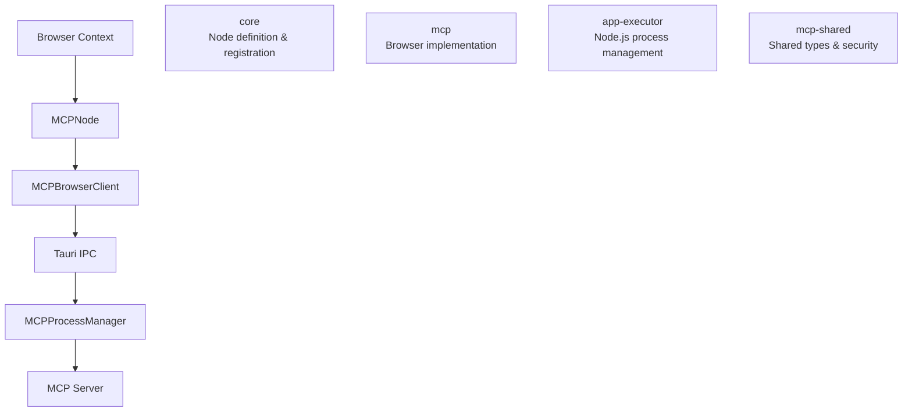

# MCP Node for Rivet

## Overview

The MCP (Model Context Protocol) Node enables secure communication between browser and Node.js contexts in Rivet. The implementation is split across three packages to maintain clear separation of concerns:

- `core`: Core node definition and registration
- `mcp`: Browser-side implementation
- `app-executor`: Node.js-side implementation and process management
- `mcp-shared`: Shared types and security module

## Features

### Dynamic Tool Discovery

- Tools are discovered dynamically via server API endpoints
- Automatic tool metadata caching with TTL
- Version-aware caching system
- Efficient tool configuration management

### Interactive UI

- Two-level dropdown selection for MCP servers and tools
- Dynamic port generation based on tool metadata
- Real-time server status monitoring
- Helpful tooltips and validation messages

### Infrastructure Monitoring

- Server health checks and status tracking
- Resource limit monitoring
- Connection state validation
- Automatic retry with backoff strategies
- Comprehensive error recovery

### Error Handling

- Protocol-level error handling (JSON-RPC 2.0)
- Tool-specific error handling
- Infrastructure error handling
- Phase-based error tracking
- Detailed error metadata

### Configuration Management

- Server-focused configuration with status tracking
- Installation and runtime status monitoring
- Endpoint management
- Environment variable configuration

### Tool Execution

- Phase-based execution tracking
- Comprehensive parameter validation
- Detailed execution logging
- Error handling with phase information

### Caching System

- Two-level caching architecture:
  - Package-level caching for installed tools (500MB limit)
  - API response caching with TTL
- Version-aware caching with automatic invalidation
- LRU-based cache management
- Efficient disk space utilization
- Cache persistence across sessions

## Configuration

### MCP Server Configuration

MCP servers are configured in `config.json`. Each server entry defines its execution environment and status:

```json
{
  "mcpServers": {
    "server-id": {
      "id": "unique-id",
      "name": "Display Name",
      "description": "Server description",
      "command": "start-command",
      "args": ["command", "arguments"],
      "env": {
        "ENV_VAR": "value"
      },
      "status": {
        "installed": false,
        "lastInstalled": null,
        "running": false,
        "lastStarted": null,
        "endpoint": "http://localhost:3000"
      }
    }
  }
}
```

### Error Handling

The node implements comprehensive error handling:

1. **Protocol Errors** (-32700 to -32603)

   - Parse errors
   - Invalid requests
   - Method not found
   - Invalid parameters
   - Internal errors

2. **Tool Errors** (-33000 to -33011)

   - Validation errors
   - Security errors
   - Resource errors
   - Tool execution errors
   - Capability errors
   - Connection errors
   - Discovery errors
   - Timeouts

3. **Cache Errors** (-33020 to -33029)
   - Cache initialization errors
   - Cache write errors
   - Cache read errors
   - Cache invalidation errors

### Retry Strategies

- Exponential backoff for connection errors
- Linear backoff for internal errors
- No retry for client errors
- Maximum 3 retry attempts

## Architecture



### Key Dependencies

- `core` depends on:

  - `app-executor` for process management
  - `mcp-shared` for types and security

- `mcp` depends on:

  - `core` for node definition
  - `mcp-shared` for types and security

- `app-executor` depends on:

  - `mcp-shared` for types and security

- `mcp-shared` has no dependencies on other MCP packages

## Dependencies

### File Dependencies

```mermaid
graph TD
    %% Core MCP Files
    MCPNode[core/MCPNode.ts] --> ProcessContext[core/ProcessContext.ts]
    MCPNode --> NodeImpl[core/NodeImpl.ts]
    MCPNode --> MCPSharedTypes[mcp-shared/types.ts]
    MCPNode --> MCPError[mcp-shared/errors.ts]

    %% MCP Browser Files
    MCPBrowserClient[mcp/browser/MCPBrowserClient.ts] --> MCPSharedTypes
    MCPBrowserClient --> ResourceManager[mcp/browser/ResourceManager.ts]
    ResourceManager --> MCPError

    %% MCP Process Management
    MCPProcessManager[app-executor/MCPProcessManager.ts] --> MCPError
    MCPProcessManager --> SecurityManager[mcp-shared/security/SecurityManager.ts]
    MCPProcessManager --> ToolCache[mcp-shared/cache/ToolCache.ts]

    %% Shared Utilities
    SecurityManager --> MCPError
    ToolCache --> MCPSharedTypes

    %% Caching System
    PackageCache[mcp/cache/PackageCache.ts] --> MCPError
    ToolCache --> MCPError

    %% State Management
    ServerStateMachine[mcp-shared/state/ServerStateMachine.ts] --> MCPError

    %% Schema and Validation
    SchemaUtils[mcp-shared/schema.ts] --> MCPError
    SchemaUtils --> RivetCore[rivet-core/DataType]

    %% Error Handling
    ErrorHandler[mcp-shared/error-handling.ts] --> MCPError

    %% Rivet Core Dependencies
    MCPNode --> RivetCore
    ProcessContext --> RivetCore

    %% Styling
    classDef core fill:#f9f,stroke:#333,stroke-width:2px
    classDef shared fill:#bbf,stroke:#333,stroke-width:2px
    classDef browser fill:#bfb,stroke:#333,stroke-width:2px
    classDef executor fill:#fbb,stroke:#333,stroke-width:2px

    %% Apply styles
    class MCPNode,ProcessContext,NodeImpl core
    class MCPSharedTypes,MCPError,SecurityManager,ToolCache,ServerStateMachine,SchemaUtils,ErrorHandler shared
    class MCPBrowserClient,ResourceManager browser
    class MCPProcessManager,PackageCache executor
```



## Adding New MCP Servers

To add a new MCP server:

1. Add server configuration to `config.json`
2. Define server tools with input/output schemas
3. Implement server functionality
4. Test integration with the MCP node

The MCP node will automatically adapt its UI and functionality based on the server configuration.
