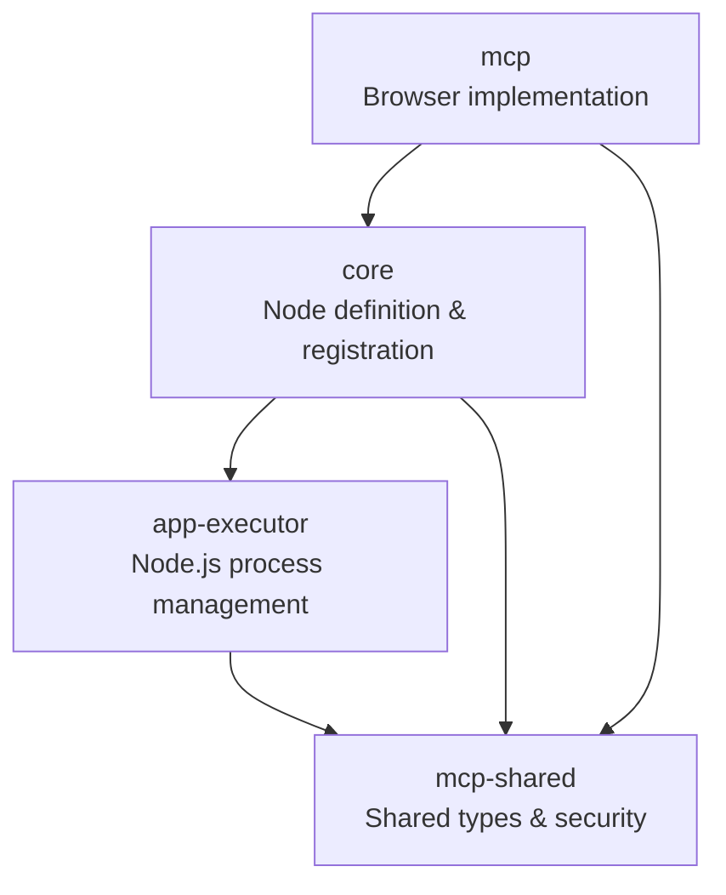

# MCP Node for Rivet

## Overview

The MCP (Multi-Context Protocol) Node enables secure communication between browser and Node.js contexts in Rivet. The implementation is split across three packages to maintain clear separation of concerns:

- `core`: Core node definition and registration
- `mcp`: Browser-side implementation
- `app-executor`: Node.js-side implementation and process management
- `mcp-shared`: Shared types and security module

## Development

### Build Commands

Two main build commands are available:

```bash
# For development - builds packages sequentially for better error tracking
yarn build:dev

# For production/CI - builds all packages in parallel respecting dependencies
yarn build:all
```

### Running the Stack

1. Build the packages:

```bash
yarn build:dev
```

2. Start the Node.js executor:

```bash
yarn workspace @ironclad/rivet-app-executor dev
```

3. Start the Rivet UI (in a separate terminal):

```bash
yarn workspace @ironclad/rivet-app dev
```

4. For development with auto-rebuild:

```bash
yarn workspace @ironclad/rivet-app-executor watch
```

## Package Organization

### Core (`core/src/model/nodes`)

Contains the core node definition:

- `MCPNode`: Core type definitions and node registration
- Imports implementation from `app-executor` package

### Browser-Side (`mcp`)

Contains components that run in the browser context:

- `MCPNode`: Browser-side node implementation that handles:
  - Node configuration and validation
  - Data flow management
  - Integration with core Rivet functionality
- `MCPBrowserClient`: Browser-side client that manages:
  - Tauri-based server communication
  - Event handling and message passing
  - Security validation of requests/responses

### Node.js-Side (`app-executor`)

Contains components that run in the Node.js context:

- `MCPProcessManager`: Process management and server communication
- Handles child process spawning and IPC
- Node.js-specific type extensions
- Exports via package entry point (`src/index.ts`)

### Shared (`mcp-shared`)

Contains shared types and security module used by all packages:

- Common type definitions (`types.ts`)
- Security management (`security/SecurityManager.ts`)
- Protocol error handling and codes

## Type System

The type system is organized to prevent duplication:

1. Core node types: Defined in `core/src/model/nodes/MCPNode.ts`
2. Protocol types: Defined in `mcp-shared/src/types.ts`
3. Node.js types: Defined in `app-executor/src/mcp/types.ts`

## Architecture

The MCP implementation follows a client-server architecture:

1. Core package defines the node interface
2. Browser-side components in `mcp` package implement the interface
3. Node.js-side in `app-executor` handles process management
4. All packages share common types and security from `mcp-shared`

## Configuration

MCP servers are configured through `config.json` in the project root. This is the authoritative source for MCP configurations.

## Dependency Diagram



### Key Dependencies

- `core` depends on:

  - `app-executor` for process management
  - `mcp-shared` for types and security

- `mcp` depends on:

  - `core` for node definition
  - `mcp-shared` for types and security

- `app-executor` depends on:

  - `mcp-shared` for types and security

- `mcp-shared` has no dependencies on other MCP packages
